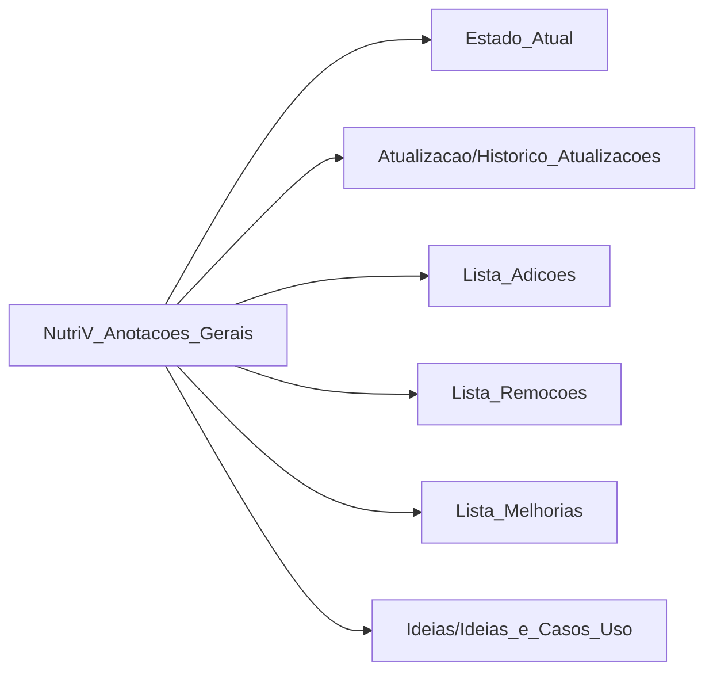

# 📚 Índice NutriV - Mapa Mental

> Rede de documentos conectados do projeto NutriV

---

## 🎯 Visão Geral



---

## 📁 Documentos Principais

| Documento | Descrição | Conexões |
|-----------|-----------|----------|
| [[NutriV_Anotacoes_Gerais]] | Visão geral + índice | → Todos |
| [[Estado_Atual]] | Arquitetura técnica atual | ← Anotações, Updates |
| [[Atualizacao/Historico_Atualizacoes]] | Cronologia de mudanças | → Remoções, Adições |
| [[Relatorios/Sessao_QA_Correcoes_Criticas_02_05_2026]] | Sessão completa de QA e correções | ← Git Log |
| [[Relatorios/Relatorio_QA_Completo]] | Primeira rodada de análise QA | → Correções |
| [[Relatorios/Relatorio_QA_Completo_Revisao_Final]] | Segunda rodada pós-correções | ← Relatorio QA |
| [[Relatorios/Correcoes_QA_02_05_2026]] | Log detalhado das correções | ← Sessão QA |
| [[Relatorio_Alteracoes_Recentes]] | Relatório detalhado das últimas mudanças | ← Git Log |
| [[Lista_Adicoes]] | Funcionalidades adicionadas | → Melhorias, Ideias |
| [[Lista_Remocoes]] | Remoções e pendências | ← Atualizações |
| [[Lista_Melhorias]] | Lista priorizada de melhorias | ← Ideias, Adições |
| [[Ideias/Ideias_e_Casos_Uso]] | Ideias e casos de uso | → Melhorias |

---

## 🔗 Fluxo de Informação

### 1. Origem → Estado Atual
```
Ideias_e_Casos_Uso + Adições + Remoções → Estado_Atual
```

### 2. Atualizações ligam tudo
```
Atualizacao → (Estado_Atual, Remoções, Adições)
```

### 3. Melhorias referencia tudo
```
Melhorias → (Ideias, Adições, Estado_Atual, Anotações)
```

---

## 🎨 Canvas

| Arquivo | Descrição |
|---------|-----------|
| [[NutriV_Mapa_Mental.canvas]] | Mapa visual interativo com links |

---

## 📋 Como Usar Este Índice

1. **Para entender o projeto**: Comece por [[NutriV_Anotacoes_Gerais]]
2. **Para ver a tecnologia**: Vá para [[Estado_Atual]]
3. **Para ver o que foi feito**: Veja [[Lista_Adicoes]] e [[Atualizacao/Historico_Atualizacoes]]
4. **Para ver relatórios de QA**: Consulte [[Relatorios/Sessao_QA_Correcoes_Criticas_02_05_2026]]
5. **Para ver o que falta**: Consulte [[Lista_Melhorias]] e [[Ideias/Ideias_e_Casos_Uso]]
6. **Para ver o que foi removido**: Veja [[Lista_Remocoes]]

---

## 🔍 Busca por Tema

### Problemas
- [[Lista_Melhorias#alta-prioridade]] → 3 problemas principais
- [[Ideias/Ideias_e_Casos_Uso#Melhorias-Identificadas]] → Detalhes

### Funcionalidades
- [[Lista_Adicoes]] → O que foi implementado
- [[Ideias/Ideias_e_Casos_Uso#Funcionalidades-Sugeridas]] → O que pode vir

### Arquitetura
- [[Estado_Atual#Stack-Tecnológico]] → Tech stack
- [[Estado_Atual#Estrutura-de-Pastas]] → Estrutura

---

## 📊 Matriz de Conexões

| De \ Para | Estado_Atual | Atualizacao | Adicoes | Remocoes | Melhorias | Ideias |
|-----------|--------------|-------------|---------|----------|-----------|--------|
| **Anotações** | → | → | → | → | → | → |
| **Estado_Atual** | - | ← | - | - | ← | ← |
| **Atualizacao** | → | - | → | → | - | - |
| **Adicoes** | ← | - | - | - | → | → |
| **Remocoes** | ← | → | - | - | - | → |
| **Melhorias** | → | - | ← | - | - | → |
| **Ideias** | ← | - | ← | → | → | - |

---

*Última atualização: 02 de Maio de 2026*
*Documento faz parte do [[NutriV_Anotacoes_Gerais]]*