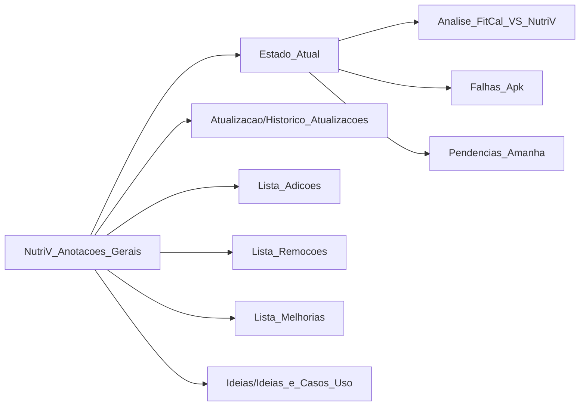

# 📚 Índice NutriV - Mapa Mental

> Rede de documentos conectados do projeto NutriV

---

## 🎯 Visão Geral



---

## 📁 Documentos Principais

| Documento | Descrição | Conexões |
|-----------|-----------|----------|
| [[NutriV_Anotacoes_Gerais]] | Visão geral + índice | → Todos |
| [[Estado_Atual]] | Arquitetura técnica atual | ← Anotações, Updates, Falhas, Pendencias |
| [[Atualizacao/Historico_Atualizacoes]] | Cronologia de mudanças | → Remoções, Adições |
| [[Relatorios/Sessao_QA_Correcoes_Criticas_02_05_2026]] | Sessão completa de QA e correções | ← Git Log |
| [[Relatorios/Relatorio_QA_Completo]] | Primeira rodada de análise QA | → Correções |
| [[Relatorios/Relatorio_QA_Completo_Revisao_Final]] | Segunda rodada pós-correções | ← Relatorio QA |
| [[Relatorios/Correcoes_QA_02_05_2026]] | Log detalhado das correções | ← Sessão QA |
| [[Relatorio_Alteracoes_Recentes]] | Relatório detalhado das últimas mudanças | ← Git Log |
| [[Lista_Adicoes]] | Funcionalidades adicionadas | → Melhorias, Ideias |
| [[Lista_Remocoes]] | Remoções e pendências | ← Atualizações |
| [[Lista_Melhorias]] | Lista priorizada de melhorias | ← Ideias, Adições |
| [[Ideias/Ideias_e_Casos_Uso]] | Ideias e casos de uso | → Melhorias |
| [[Analise_FitCal_VS_NutriV]] | Comparativo com app concorrente | → Falhas, Pendencias |
| [[Falhas_Apk]] | Bug report - sync Supabase | → Correções, [[Pendencias_Amanha]] |
| [[Pendencias_Amanha]] | Tarefas para próxima sessão | ← Falhas, → Correções |

---

## 🗺️ Canvas Visual

| Arquivo | Descrição |
|---------|-----------|
| [[NutriV_Mapa_Mental.canvas]] | Mapa visual interativo com links |

---

## 🔍 Fluxo de Informação

### 1. Origem → Estado Atual
```
Ideias_e_Casos_Uso + Adições + Remoções → Estado_Atual
```

### 2. Atualizações ligam tudo
```
Atualizacao → (Estado_Atual, Remoções, Adições)
```

### 3. Melhorias referencia tudo
```
Melhorias → (Ideias, Adições, Estado_Atual, Anotações)
```

### 4. Relatórios QA (Novo Fluxo)
```
Correcoes_QA_02_05_2026 → (Sessao_QA_Correcoes, Relatorio_QA_Completo_Revisao_Final)
```

---

## 🔍 Matriz de Conexões

| De \ Para | Estado_Atual | Atualizacao | Adicoes | Remocoes | Melhorias | Ideias | Falhas | Pendencias | Analise_FitCal | Relatorios |
|-----------|--------------|-------------|---------|----------|-----------|--------|--------|-----------|---------------|------------|
| **Anotações** | → | → | → | → | → | → | → | → | → |
| **Estado_Atual** | - | ← | - | - | ← | ← | ← | ← | - | → |
| **Atualizacao** | → | - | → | → | - | - | - | - | - | → |
| **Adicoes** | ← | - | - | - | → | → | - | - | - | → |
| **Remocoes** | ← | → | - | - | - | → | → | → | - | → |
| **Melhorias** | → | - | ← | - | - | → | - | - | - | → |
| **Ideias** | ← | - | ← | → | → | - | - | - | - | → |
| **Falhas** | → | - | - | → | - | - | - | → | → | → |
| **Pendencias** | → | - | - | → | - | - | ← | - | → | → |
| **Analise_FitCal** | → | - | - | - | → | → | → | → | - | → |
| **Relatorios** | → | → | → | → | → | → | → | → | → | - |

---

## 🔎 Busca por Tema

### Problemas
- [[Lista_Melhorias#alta-prioridade]] → 3 problemas principais
- [[Ideias/Ideias_e_Casos_Uso#Melhorias-Identificadas]] → Detalhes
- [[Falhas_Apk#Problema]] → Bug crítico sync
- [[Pendencias_Amanha#Priority-1]] → CRÍTICO: Auth, Offline

### Funcionalidades
- [[Lista_Adicoes]] → O que foi implementado
- [[Ideias/Ideias_e_Casos_Uso#Funcionalidades-Sugeridas]] → O que pode vir
- [[Relatorios/Relatorio_QA_Completo]] → QA issues encontrados

### Arquitetura
- [[Estado_Atual#Stack-Tecnologico]] → Tech stack
- [[Estado_Atual#Estrutura-de-Pastas]] → Estrutura
- [[NutriV_Mapa_Mental.canvas]] → Visual interativo

### Comparativos
- [[Analise_FitCal_VS_NutriV#Funcionalidades-FALTANTES]] → O que FitCal tem e NutriV não
- [[Analise_FitCal_VS_NutriV#Funcionalidades-PARCIAIS]] → O que está incompleto

---

## 📊 Relatórios de QA (Atualizado 02/05/2026)

### Sessão de Correções Críticas
1. **[[Relatorios/Sessao_QA_Correcoes_Criticas_02_05_2026]]** - QA completa
2. **[[Correcoes_QA_02_05_2026]]** - Log detalhado de mudanças
3. **[[Relatorios/Relatorio_QA_Completo]]** - Primeira análise
4. **[[Relatorios/Relatorio_QA_Completo_Revisao_Final]]** - Revisão pós-correções

### Problemas Resolvidos (Commit 2dee6c8)
- ✅ Auth/Onboarding usa Supabase real
- ✅ Logout corrigido (/login ao invés de /onboarding)
- ✅ IDs únicos em add alimentos
- ✅ Progress page conectada a dados reais
- ✅ Error handling em recipes page
- ✅ Fallback local em AI service
- ✅ Gemini API fix (responseMimeType removido)

---

## 🚀 Como Usar Este Índice

1. **Para entender o projeto**: Comece por [[NutriV_Anotacoes_Gerais]]
2. **Para ver a tecnologia**: Vá para [[Estado_Atual]]
3. **Para ver o que foi feito**: Veja [[Lista_Adicoes]] e [[Atualizacao/Historico_Atualizacoes]]
4. **Para ver relatórios de QA**: Consulte [[Relatorios/Sessao_QA_Correcoes_Criticas_02_05_2026]]
5. **Para ver o que falta**: Consulte [[Lista_Melhorias]] e [[Ideias/Ideias_e_Casos_Uso]]
6. **Para ver o que foi removido**: Veja [[Lista_Remocoes]]
7. **Para ver bugs conhecidos**: Leia [[Falhas_Apk]] e [[Pendencias_Amanha]]
8. **Para comparar com concorrência**: [[Analise_FitCal_VS_NutriV]]

---

## 📌 Quick Links Úteis

### Arquivos de Configuração
- `nutriv/lib/main.dart` → Rotas e inicialização
- `nutriv/lib/core/di/injection.dart` → Injeção de dependências
- `nutriv/lib/data/datasources/auth_service.dart` → Autenticação
- `nutriv/lib/data/repositories/sync_meal_repository.dart` → Sync Supabase

### Páginas Recentemente Corrigidas
- ✅ `presentation/pages/onboarding/onboarding_page.dart` - Auth real
- ✅ `presentation/pages/login/login_page.dart` - Login Google fix
- ✅ `presentation/pages/profile/profile_page.dart` - Logout fix
- ✅ `presentation/pages/profile/progress_page.dart` - Dados reais
- ✅ `presentation/pages/recipes/recipes_page.dart` - Error handling
- ✅ `presentation/pages/scanner/scanner_page.dart` - IDs únicos
- ✅ `data/datasources/ai_food_service.dart` - Fallback local

### Relatórios de Correções
- **[[Correcoes_QA_02_05_2026]]** ← Commit 2dee6c8
- **[[Relatorios/Relatorio_QA_Completo_Revisao_Final]]** ← Segunda análise
- **[[Relatorios/Sessao_QA_Correcoes_Criticas_02_05_2026]]** ← Sessão completa

---

## 🔗 Links Externos Citados
- FitCal: https://fitcalai.app/
- Supabase Docs: https://supabase.com/docs
- Flutter BLoC: https://bloclibrary.dev/
- Gemini API: https://ai.google.dev/

---

*Última atualização: 02 de Maio de 2026*
*Documento faz parte do [[NutriV_Anotacoes_Gerais]]*
*Commit mais recente: 2dee6c8 (fix: correções críticas QA)*